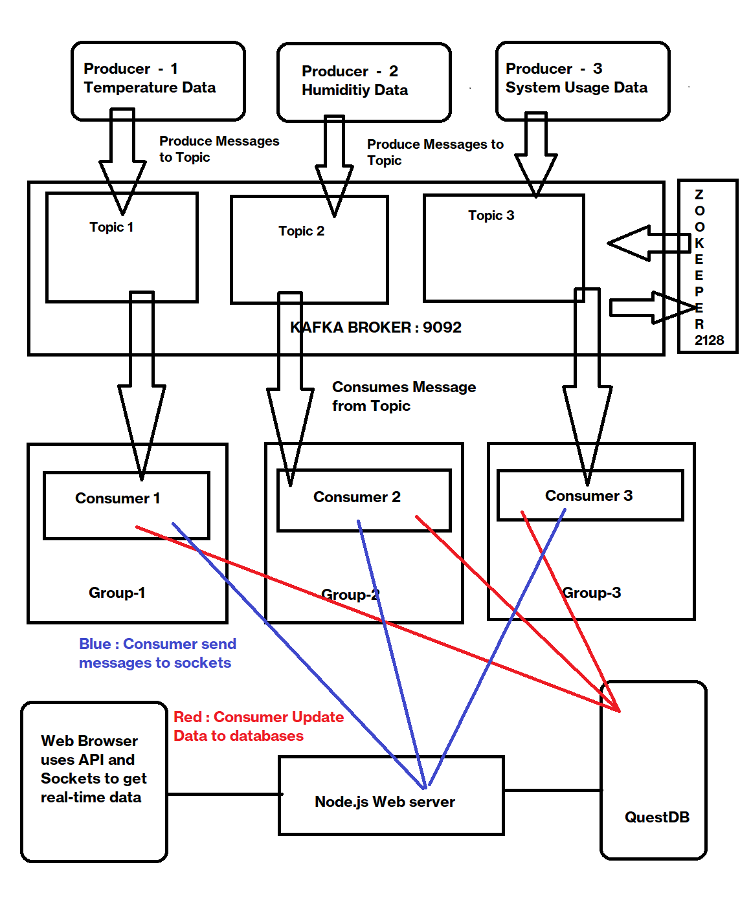
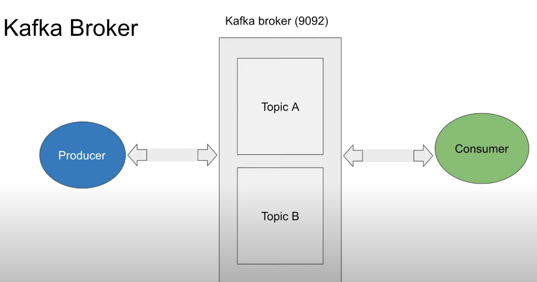
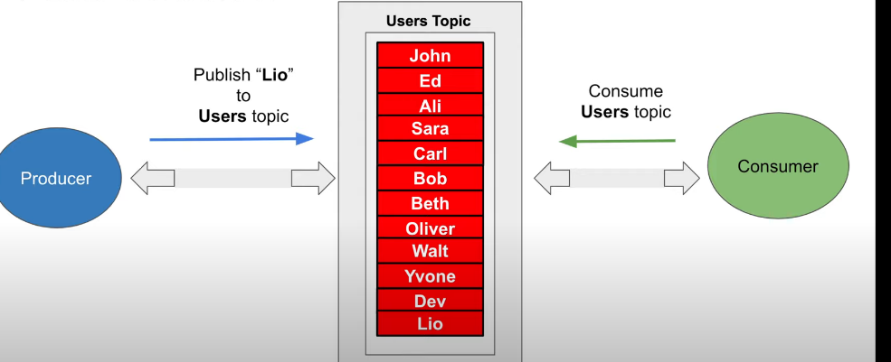
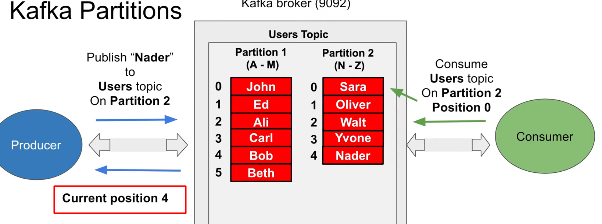
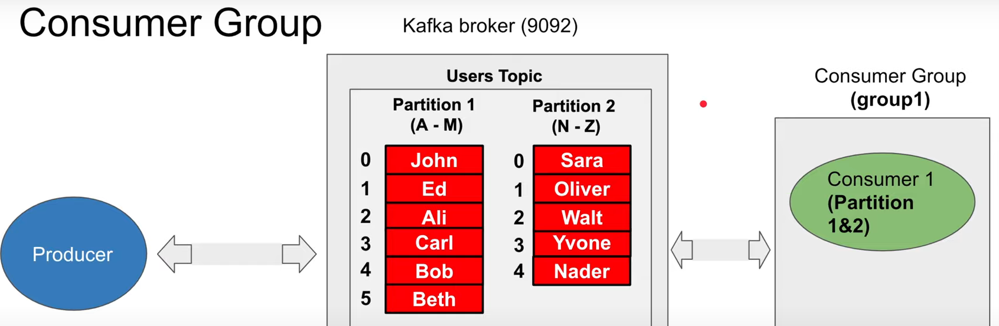
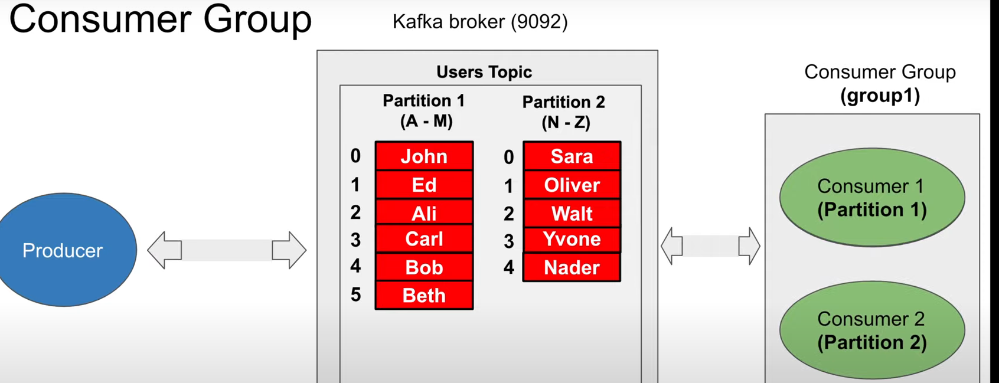
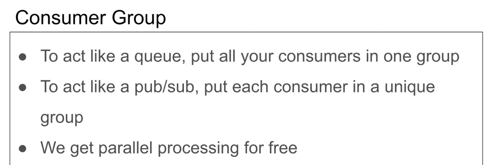
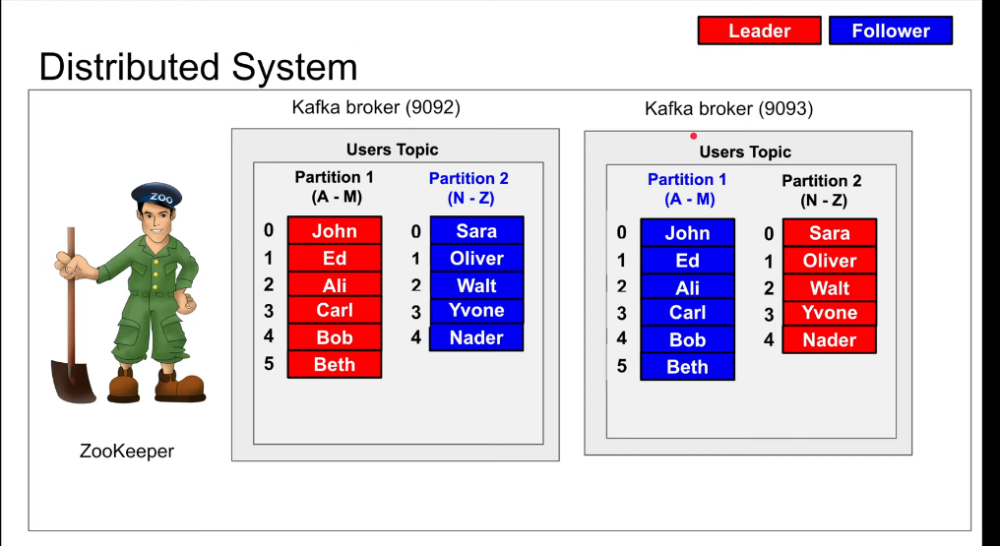

# Table of Contents
1. [About Project](#about-project)
2. [Systems architecture (High Level)](#systems-architecture)
3. [Running Project](#running-project)
4. [Kafka](#kafka)
    - [Queue vs Pub/Sub](#queue-vs-pubsub)
    - [Kafka Broker](#kafka-broker)
    - [Kafka Producer and Consumer](#kafak-producer-and-consumer)
    - [Kafka Partitions](#kafka-partitions)
    - [Consumer Group](#consumer-group)
    - [Distributed System with Kafka and zookeeper](#distributed-system-with-kakfa-with-zookeeper)
    - [Running Kafka with zookeeper on Docker](#running-kafka-with-zookeeper-on-docker)


# **About Project**

It is real-time dashboard. It uses kafka to produce dummy temperature, humiditiy and system usage data. This data is saved in database and view real-time in web-browser with charts.

## **Running demo of project**

<video width="320" height="240" controls>
    <source src="https://github.com/virengajera/realtime-dashboard/blob/main/assets/recording%20of%20realtime%20dashboard.mp4" type="video/mp4">
</video>


# **Systems architecture**

Each Producer produces messages to its own topic.

Each consumer consumes those message does 2 opertions:
- Inserts data in QuestDB
- Sends the same message to node.js server via. web-sockets.

Browser : It gets real-time data from node.js server through web-sockets. For inital loading of page uses API to get values from Databases

|  | 
|:--:| 
| *System architecture* |


# **Running Project**

1. Create Docker container by running `docker-compose up`. Make sure this container is running in background.
2. To Run Producers : Navigate to folder `cd kafka-producer-consumer`
3. Install dependencies: `npm install`
4. Run Admin file in order to create topics `node admin.js`
5. Run the producers. **Note:** We have start all the producer as seperate process and it should be running in the background.
```
node producer.js temperature
node producer.js humidity
node producer.js systemusage
```
6. To run Consumers like produce we will start 3 different node process.
```
node consumer.js temperature
node consumer.js humidity
node consumer.js systemusage
```
7. In order to run dashboard navigate to `cd dashboard`
8. Install dependencies `npm install`
9. Run web-server by `node server.js`. You will able view dashboard by visiting http://localhost:3001/


# **Kafka**

## **Queue vs Pub/Sub**


**Kafka** can implement both Queue and Pub/Sub with **Consumer Group**

| Queue | Pub/Sub |
|-----------|-----------|
| Message is published once and consume once(only one consumer)| Message can be consumed by Multiple consumer|
| Once message is consume by consumer-1 then same message cannot be consumed by consumer-2 | Same message can be consumed by Multiple consumer|
| e.g. Consider Payment system once message is published you want only one system to execute payment process one time only.| e.g. Broadcasting message. Youtube video once compressed can be broadcasted to multiple devices so that they all can view compressed video. |


## **Kafka Broker**

**Kafka Broker :** It is a Kafka Server running on port default port of **9092**.

**Topics :** 
Logical partitions of Messages. From where you read and write messages.


|  | 
|:--:| 
| *Kafka broker with Topics* |


## **Kafak Producer and Consumer**

Producer publishes message to topic and consumer consumes those message from topic.

Consumer is responsible for getting messages from Topics. While in RabbitMQ broker pushes messages.

|  | 
|:--:| 
| *Kafka Producer and Consumer* |


## **Kafka Partitions**

When publisher publishes message to partition it returns "Current Position" value.

|  | 
|:--:| 
| *Kafka Partitions* |


## **Consumer Group**

Through consumer group you can implement queue or pub/sub. Multiple consumer group can consume data in parallel.

If you have only 1 Consumer-Group and 1-Consumer that consumer will be responsible for all the partitions means all the messages from multiple partitions can be read.

|  | 
|:--:| 
| *Consumer group with one consumer* |


By adding one more consumer in group it rebalances means consumer-1 will get partion-1 and consumer-2 will get partition-2. 

You can have consumer-1 consume multiple partions and consumer-2 consume single partition. But good practice is each consumer should have its own partition. **By having each consumer having individual parition you can achieve queue**. They run in parallel.


|  | 
|:--:| 
| *Each consumer get individual partition it behaves like queue* |


**By putting each consumer in its own unique/individual consumer group you can achieve Pub/Sub.** It is at group level. So group-1 and group-2 can read same partition and positiion of message will be at group level.


|  | 
|:--:| 
| *Consumer group achieve queue or pub/sub* |


## **Distributed System with Kakfa with zookeeper**

In distributed system you tends to replicate. Follower copies data from Leader. Now problem arises when Leadear went down then from whom follower is going to copy data.

So, in Kafka at partitions Level Leadear and Follower is maintaine. Broker-1 will be Leader of Partition-1 and follower of Broker-2 Partition-2 . Broker-2 will be leader of Partition-2 and follower of Broker-1 partition-1.

This information of leader and follower is stored in Zookeeper server.

Producing Message : When you publish message. In the backend both server communicates(gossip) with each other and writes messages to corresponding partition with leader in correct broker.
 

|  | 
|:--:| 
| *Kafka distributed system with zookeeper* |


## **Running Kafka with zookeeper on Docker**

Spin up Zookeeper : 
```docker run -p 2181:2181 --name zookeeper zookeeper:latest```


Spin up Kafka with 1 cluster : 
```docker run -p 9092:9092 -e KAFKA_ZOOKEEPER_CONNECT=localhost:2181 -e KAFKA_ADVERTISED_LISTENERS=PLAINTEXT://localhost:9092 -e KAFKA_OFFSETS_TOPIC_REPLICATION_FACTOR=1 --name kafka confluentinc/cp-kafka```

you need to specify enviroment varaible with -e for kafka you need zookeeper. Also listener  we define on which port they send and consume message also plaintext protocol is defined means un-encrypted. Last Replication part indicates how many instances of kafka you want we want only one.
