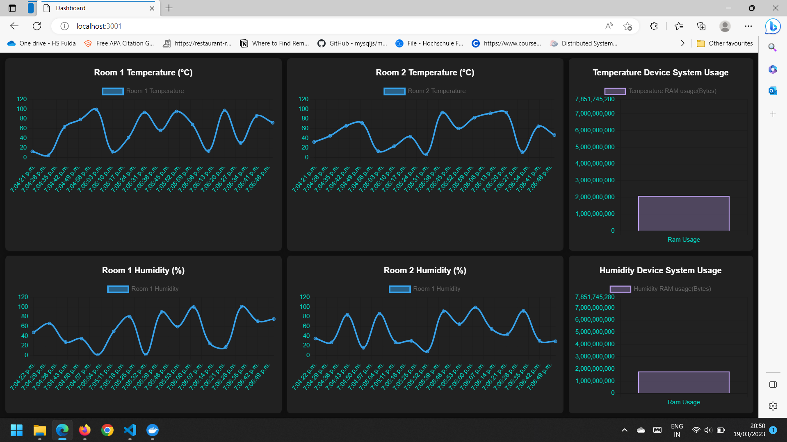
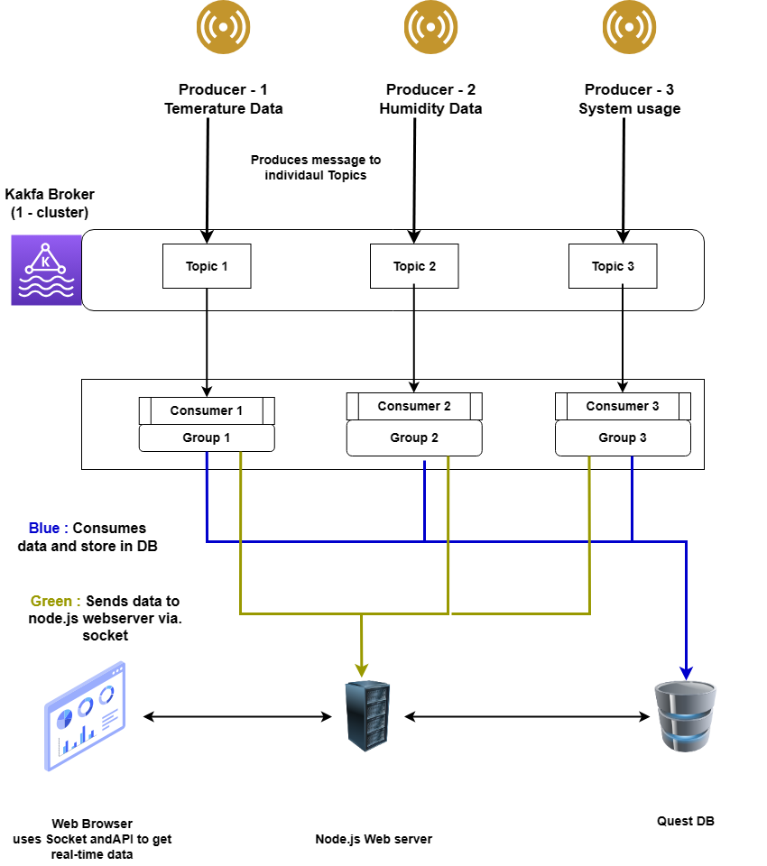

# Table of Contents
1. [About Project](#about-project)
    - [Running demo of Project](#running-demo-of-project)
2. [Systems architecture (High Level)](#systems-architecture)
3. [Running Project](#running-project)


# **About Project**

It is real-time iot dashboard in which sensor data are produced in real-time and handled using Kafka. In Browser you can visualize those data in real-time with charts.

## **Running demo of project**


https://user-images.githubusercontent.com/72183120/226206505-4ff3e4e2-496e-471d-8c62-d14fce9080cd.mp4


|  | 
|:--:| 
| *Dashboard Snapshot* |


# **Systems architecture**

Kafka Producer : produces data(temperature, humidity and ram usage data) and publishes those messages to its own kafka Topics.

Kafka consumer : consumes those message by subscribing those topics and perform 2 opertions with each message:
- Inserts data in QuestDB
- Sends the same message to node.js server via. web-sockets.

Browser : Data are fetched throug API for intial rendering and For real-time it uses web-sockets and updates charts in real-time.

|  | 
|:--:| 
| *System architecture* |


# **Running Project**

1. Create Docker container by running `docker-compose up`. Make sure this container is running in background.
2. To Run Producers : Navigate to folder `cd kafka-producer-consumer`
3. Install dependencies: `npm install`
4. Run Admin file in order to create topics `node admin.js`
5. Run the producers. 
**Note:** All the producer must run as a seperate process and it should be running in the background.
```
node producer.js temperature
node producer.js humidity
node producer.js systemusage
```
6. To run Consumers is similar to producer where we will start 3 different node process.
```
node consumer.js temperature
node consumer.js humidity
node consumer.js systemusage
```
7. In order to run dashboard navigate to `cd dashboard`
8. Install dependencies `npm install`
9. Run web-server by `node server.js`. You will able view dashboard by visting http://localhost:3001/
